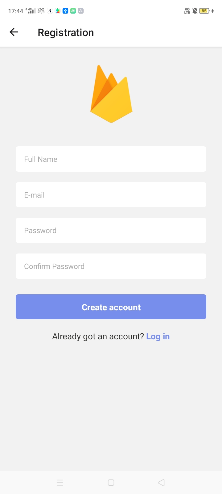

# React Native Firebase


This is a React Native Firebase Starter Project with login, registration and database. You can use this project as boilerplate for bootstrapping any new React Native app that uses Firebase as its backend.

<center></center>


<center></center>

## Features 🚀


* Registration with E-mail & Password
* Login with E-mail and Password
* Writing to Firestore Database
* Reading from Firestore Database

## Getting Started (with Expo)

If you are using Expo Cli, clone the repo and run "expo start" in the root folder of the project:

```
git clone <link>
cd react-native-firebase
expo start
```


## Contributions and PR

 - PRs should be generated against `master`


**Thanks to [Free Code Camp](https://www-freecodecamp-org.cdn.ampproject.org/c/s/www.freecodecamp.org/news/react-native-firebase-tutorial/amp/) for the tutorial.**
